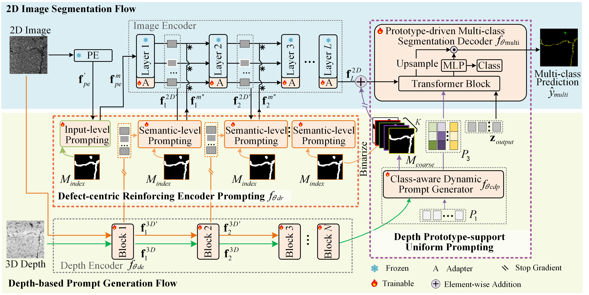

# <p align=center>`Bimodal Defect Segmentation with Geometric Prior-supported Anti-imbalance Learning for Pavement Defect Evaluation and Repair`</p>

<p align="center">
     <br />
    <em> 
    The structure of the proposed network
    </em>
</p>

## 1、🌟  Datasets 

The constructed Bimodal Multi-category Pavement Defect (BMPD) dataset and publicly available NPO++ dataset can be accessed via the following links:

| BMPD | [Baidu Netdisk](https://pan.baidu.com/s/1KjU11Cagr88tyy_DDNOcaA?pwd=km76|
| NPO++ |[PotCrackSeg](https://github.com/lab-sun/PotCrackSeg.git) | 

## 2. 🚀 Get Start

```
git clone https://github.com/Yaan-Wang/GPAL.git
cd GPAL
mkdir dataset
mkdir ckpts
```

**1. Download Datasets and Pretrained Ckeckpoints**

Download the datasets from the above link, and put them into the folder 'dataset'.  Download pretrained ckeckpoints via [Baidu Netdisk](https://pan.baidu.com/s/11ViqYktU8MaMoKRfMvbTuw?pwd=6abx) and put them into the folder 'ckpts'.


**2. Train & Test**

BMPD Dataset

```
cd  GPAL/BMPD_EXP
mkdir output
```
Train
```
bash train.sh
```
Test
```
bash test.sh
```
After training and testing , the checkpoints and test results will be saved in the path `output'.

NPO++ Dataset

```
cd  GPAL/NPO_EXP
mkdir output
```
Train
```
bash train.sh
```
Test
```
bash test.sh
```

After training and testing , the checkpoints and test results will be saved in the path `output'.

> We invite all to contribute in making it more acessible and useful. If you have any questions or suggestions about our work, feel free to contact me via e-mail (wangyanyan_neu@163.com). 

## Reference

You may want to cite:
```
@article{WANG2025106497,
title = {Bimodal defect segmentation with Geometric Prior-supported Anti-imbalance Learning for pavement defect evaluation and repair},
journal = {Automation in Construction},
volume = {180},
pages = {106497},
year = {2025},
issn = {0926-5805},
doi = {https://doi.org/10.1016/j.autcon.2025.106497},
url = {https://www.sciencedirect.com/science/article/pii/S0926580525005370},
author = {Yanyan Wang and Kechen Song and Yuyuan Liu and Tianze Li and Yunhui Yan and Gustavo Carneiro}
}


### License

Code in this repo is for non-commercial use only.


